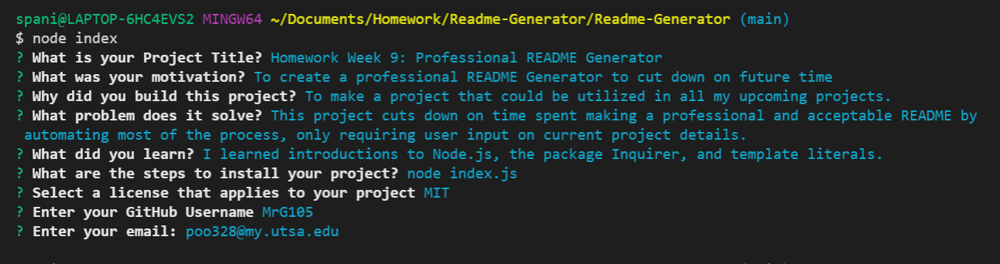

# <Homework Week 9: Professional README Generator>  

  

  ## Description  
  ### What was your motivation?  
    - To create a professional README Generator to cut down on future time  
  ### Why did you build this project?  
    - To make a project that could be utilized in all my upcoming projects.  
  ### What problem does it solve?  
    - This project cuts down on time spent making a professional and acceptable README by automating most of the process, only requiring user input on current project details.  
  ### What did you learn making this project?  
    - I learned introductions to Node.js, the package Inquirer, and template literals.  
   
  ## Table of Contents 
  - [Installation](#installation)  
  - [Usage](#usage)  
  - [Credits](#credits)  
  - [License](#license)  

  ## Installation  
  ### The application will be invoked by using the following command:  
     node index.js  

## Usage  
  
      
  ## Credits  
  Contact me at: [email](poo328@my.utsa.edu "email")  
  Github can be located at: [Github](https://github.com/MrG105 "Github")  
    
  ## License
      Licensed under the MIT license  
  ---